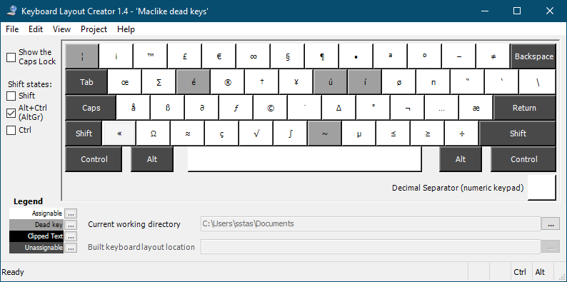
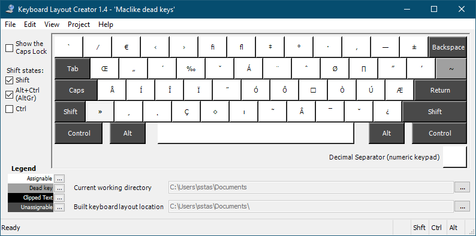

MacOS-like keyboard layout for Windows
======================================

A QWERTY Windows keyboard layout that has dead keys and special characters
mapped much like the [MacOS dead keys]. This allows finger
reflexes to be transferable between both platforms.

### Main layer, to use hold AltGr or Alt+Ctrl



### Second layer, to use hold Shift+AltGr or Shift+Alt+Ctrl



### MacOS 10.15 dead keys


Supported symbols
-----------------

This layout currently supports:

- Most Latin grave accents;
- All Latin acute accents (Basic latin, Latin-1 Supplement, Latin Extended-A,
  Latin Extended-B and Latin Extended Additional unicode blocks);
- Most Latin diaeresis accents (Basic latin, Latin-1 Supplement, and Latin
  Extended-A);
- Most Latin tilde accents (Basic latin, Latin-1 Supplement, and Latin
  Extended-A);
- Special characters available on the MacOS alt layout.

This layout is based on the English-UK keyboard layout. All default acute
accents can still be typed by double pressing the dead key, e.g AtlGr+u AtlGr+u
wil result in ú.

Differences vs the MacOS alt layout:

- More accent combinations are supported.
- Accents on AltGr+vowel characters as defined by the system Windows UK English
  layout.
- Cent sign is moved from AltGr+4 to AtlGr+# to allow for € sign on AltGr+4.
- AltGr+~ (AltGr+Shift+#) is an alternative tilde dead key.

Installation and usage
----------------------

- Download maclike.zip in the [latest version of the keyboard package installer][release].
- Run setup.exe and restart Windows.
- Set up the keyboard on Windows. E.g on Windows 10:
  - Navigate to settings > Time & Language > Language
      - Click on your system language > options and "Add a keyboard"
      Or
      - Click on "Choose an input method to always use as default" if you prefer
        to always use the same layout.

Modifying
---------

To modify this keyboard layout, install [Microsoft Keyboard Layout Creator] and
open the maclike-dead-keys.klc file. The Keyboard Layout installer can be
generated using Project > Build DLL and Setup Package.

Note that the keyboard layout needs to be fully uninstalled for this to work.

Note on un/reinstallation
-------------------------

This keyboard package can be uninstalled like any MSI package, e.g through
Setting > Add or remove programs or by launching the installer again.
However, doing so will not remove certain registry entries, preventing the
keyboard layout to be modified.

In order to fully uninstall this keyboard package, e.g to install a new/adapted
version, the register entry needs to be removed. On Windows 10 this is the last
entry in:

```
Computer\HKEY_LOCAL_MACHINE\SYSTEM\CurrentControlSet\Control\Keyboard Layouts
```

But it's best to double check the "Layout Text" value before removal.

For more info see ["How do I remove a keyboard layout" on MSDN][remove-layout].

[MacOS dead keys]: https://support.apple.com/en-ie/guide/mac-help/mh27474/mac
[Microsoft Keyboard Layout Creator]: https://www.microsoft.com/en-us/download/details.aspx?id=22339
[release]: https://github.com/seppestas/maclike-windows-keyboard-layout/releases/latest
[remove-layout]: https://social.msdn.microsoft.com/Forums/ie/en-US/6e143a03-3fda-43fd-831b-2c3056d732b1/how-do-i-remove-a-keyboard-layout
